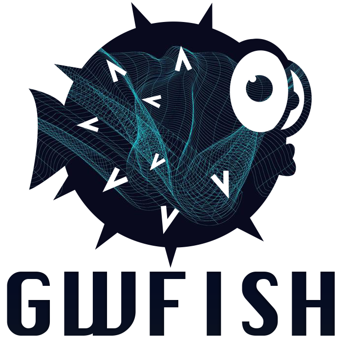

# GWFish

## About

<p align="center">
  
</p>
Simulation of gravitational-wave detector networks with Fisher-matrix PE

Shield: [![CC BY 4.0][cc-by-shield]][cc-by]

Read the documentation [here](https://gwfish.readthedocs.io)!

## Citation

Please cite [GWFish publication](https://doi.org/10.1016/j.ascom.2022.100671) if you make use of the code:
```
@ARTICLE{DupletsaHarms2023,
        author = {{Dupletsa}, U. and {Harms}, J. and {Banerjee}, B. and {Branchesi}, M. and {Goncharov}, B. and {Maselli}, A. and {Oliveira}, A.~C.~S. and {Ronchini}, S. and {Tissino}, J.},
        title = "{GWFISH: A simulation software to evaluate parameter-estimation capabilities of gravitational-wave detector networks}",
        journal = {Astronomy and Computing},
        keywords = {General Relativity and Quantum Cosmology},
        year = 2023,
        month = jan,
        volume = {42},
        eid = {100671},
        pages = {100671},
        doi = {10.1016/j.ascom.2022.100671},
        archivePrefix = {arXiv},
        eprint = {2205.02499},
        primaryClass = {gr-qc},
        adsurl = {https://ui.adsabs.harvard.edu/abs/2023A&C....4200671D},
        adsnote = {Provided by the SAO/NASA Astrophysics Data System}
}
```

## Open GWFish tutorial in Google Colab

The tutorial notebook can be opend in Google Colab without the need to download locally any package. Here is the link:

* ``gwfish``: [Notebook GWFish](<https://colab.research.google.com/https://github.com/janosch314/GWFish/blob/main/gwfish_tutorial.ipynb>)


This work is licensed under a [Creative Commons Attribution 4.0 International
License][cc-by].

[![CC BY 4.0][cc-by-image]][cc-by]

[cc-by]: http://creativecommons.org/licenses/by/4.0/
[cc-by-image]: https://i.creativecommons.org/l/by/4.0/88x31.png
[cc-by-shield]: https://img.shields.io/badge/License-CC%20BY%204.0-lightgrey.svg
